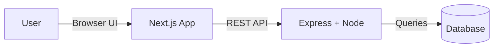
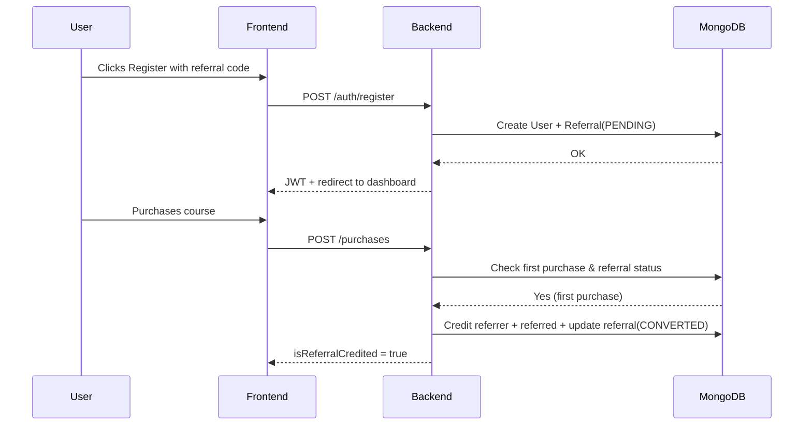

````markdown
# Referral & Credit System — FileSure Assignment

A full-stack digital product platform that implements a **referral and credit reward system**.  
Users can register, share referral links, earn credits from conversions, and track everything on a dashboard.

---

## 🚀 Live Demo
🔹 Frontend (Vercel): _Add Link Here_  
🔹 Backend API: _Add Link Here_  

---

## 🛠️ Tech Stack

| Layer | Technologies |
|------|--------------|
| Frontend | Next.js (App Router), TypeScript, Tailwind CSS, Framer Motion, Zustand |
| Backend | Node.js, Express, TypeScript, JWT Auth |
| Database | MongoDB (Mongoose) |
| Deployment | Vercel (frontend), Render/Railway (backend) |

---

## ✨ Features

✔ Secure login & registration  
✔ Referral code generation on signup  
✔ Referral tracking (pending → converted)  
✔ First-purchase reward logic (2 credits each)  
✔ Prevent double crediting using transactional flow  
✔ Dashboard with:
- Total referred users
- Converted referrals count
- Total credits earned
- Copyable referral link

✔ Responsive, modern UI  
✔ Auth state persisted (Zustand)

---

## 🔑 How Credits Work – Business Logic

1️⃣ A user signs up → gets a referral link  
2️⃣ Someone signs up using that link → **PENDING referral** stored  
3️⃣ First purchase by referred user →  
   - Referrer: +2 credits  
   - Referred: +2 credits  
   - Referral status updates → **CONVERTED**  
4️⃣ Further purchases do **not** give extra credits

> All logic is enforced server-side to prevent fraud.

---

## 📦 Local Setup

```bash
git clone <repo_url>
cd backend
npm install
npm run dev
````

```bash
cd frontend
npm install
npm run dev
```

Backend → runs on: `http://localhost:5000`
Frontend → runs on: `http://localhost:3000`

---

## 🌱 Environment Variables

### 📌 Backend → `.env`

```env
MONGODB_URI=
JWT_SECRET=
PORT=5000
FRONTEND_URL=http://localhost:3000
```

Include `.env.example` in repo ✔

### 📌 Frontend → `.env.local`

```env
NEXT_PUBLIC_API_URL=http://localhost:5000
```

---

## 📡 API Endpoints Overview

| Method | Endpoint         | Purpose                                         | Auth |
| ------ | ---------------- | ----------------------------------------------- | ---- |
| POST   | `/auth/register` | Create user + referral assignment               | ❌    |
| POST   | `/auth/login`    | Login -> JWT token                              | ❌    |
| GET    | `/me/dashboard`  | Dashboard stats                                 | ✔    |
| POST   | `/purchases`     | Simulate product purchase + referral conversion | ✔    |

JWT sent via:
`Authorization: Bearer <token>`

---

## 🧱 System Architecture (UML Diagram)

### 🏗️ High-Level Architecture



---

### 🔁 Referral Flow Sequence Diagram



---


Made with ❤️ by **Prachiti Kitey**


 

